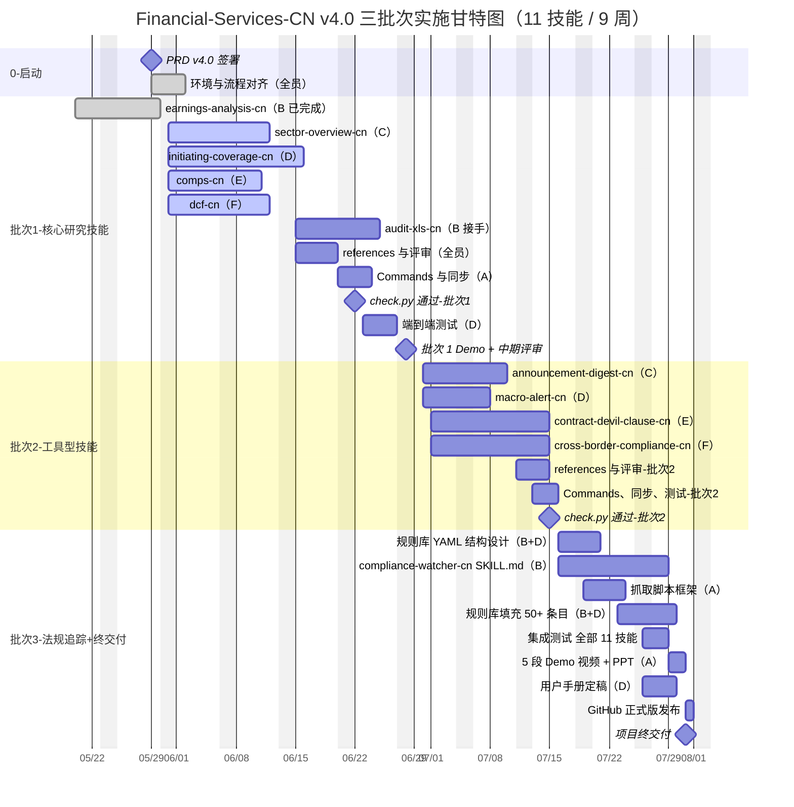

# Financial-Services-CN 产品需求文档（PRD）

| 字段 | 内容 |
| :--- | :--- |
| **项目名称** | Financial-Services-CN（Anthropic 金融插件中文版） |
| **文档版本** | v4.0 |
| **交付截止** | 2026-07-31（全部 11 个技能 + 演示交付） |
| **负责人** | A（技术 + 产品） |
| **执行团队** | A、B、C、D、E、F（共 6 人，匿名化） |
| **代码仓** | [financial-services/](financial-services/) |
| **基线参考** | [earnings-analysis-cn/SKILL.md](financial-services/plugins/vertical-plugins/equity-research/skills/earnings-analysis-cn/SKILL.md)（已完成，质量基线） |

---

## 一、项目背景与战略定位

### 1.1 背景

Anthropic 于 2026 年初开源 [financial-services](https://github.com/anthropics) 插件包，覆盖 7 个金融垂直行业 + 10 个命名 Agent，但全部基于**美股 GAAP / 英文披露 / FactSet & S&P 海外数据源**。直接服务中国市场存在五大本土差异：

1. **政策影响极大**——产业政策、监管文件解读频繁，是 A 股估值的核心变量
2. **舆情环境复杂**——巨潮 / 互动易 / 雪球 / 东方财富 / 抖音多源并存，需交叉验证
3. **数据质量参差**——非结构化披露与口径不统一，需机器抽取 + 人工校核
4. **本土产品丰富**——北交所、定增、可转债、REITs、新股、专精特新，海外模板不适配
5. **合规要求更严**——中证协执业规范、监管留痕、可解释性，比海外标准更严苛

### 1.2 战略定位：**服务中国金融市场的"长尾刚需"，覆盖大机构盲区**

本项目定位**不是**与中信、中金、华泰等头部券商研究所竞争，而是**填补大机构不愿做、做不了、或商业模式不允许做的市场盲区**。

#### 三个核心盲区

| 盲区 | 大机构为什么不做 | 我们的切入 |
| :--- | :--- | :--- |
| **散户 / 个人投资者** | 单客户产值低，机构服务门槛 100 万起 | 让散户也能拥有"卖方研究员级别"的工具：业绩点评、估值核验、合同审查 |
| **中小机构 / 中小券商资管** | 内部团队规模小，订阅 Wind / Bloomberg + 律所合规咨询年成本 >300 万 | 用开源工具替代部分自建研究 / 合规中后台 |
| **跨场景刚需小工具** | 大机构内部"半成品脚本"不会对外提供 | 公告精读、宏观异动、跨境监管、合同魔鬼条款审查、监管法规追踪 |

#### 战略原则

- **A 股 / 中国监管口径优先**：所有技能默认 CAS 准则、中证协规范、中国监管框架
- **中英文技能共存**：通过 description 触发关键词分流，架构零侵入
- **聚焦"做了有用但商业上不划算"的工具**：以开源杠杆撬动散户和中小机构的真实需求
- **质量对标顶级券商研究所**：每个技能 SKILL.md ≥400 行，深度与中信、中金、海通等公开研报相当

---

## 二、用户场景矩阵与差异化护城河

### 2.1 用户痛点 → 技能映射

| 用户类型 | 真实痛点 | 现有市场服务（高成本/不可得） | 本项目对应技能 |
| :--- | :--- | :--- | :--- |
| **散户投资者** | 看不懂研报真假 / 自己分析公司能力弱 | 私募研究服务 ≥10 万/年；FactSet ≥30 万/年 | earnings-analysis-cn、comps-cn、dcf-cn |
| **散户投资者** | 海量公告淹没关键信息 | 资讯服务订阅 1.5-3 万/年 | announcement-digest-cn |
| **散户投资者** | 宏观异动不会解读 | 卖方宏观团队仅服务机构客户 | macro-alert-cn |
| **散户/小资金** | 买基金 / 信托不懂合同 | 律师审查 5000-30000 元/小时 | contract-devil-clause-cn |
| **中小券商资管** | 没钱养完整研究 + 合规中台 | 自建团队年成本 300-500 万 | 全部 11 个技能组合使用 |
| **公司法务 / IPO 团队** | 招股书 / 产品材料合规自查 | 律所合规审查 50-200 万/项目 | compliance-watcher-cn |
| **出海企业** | 收到海外监管函看不懂 | 跨境律所翻译 800-2000 元/页 | cross-border-compliance-cn |
| **写研报的实习生 / 新人** | 不会做行业研究、首次覆盖 | 师徒制学习，无标准模板 | sector-overview-cn、initiating-coverage-cn |
| **机构合规风控** | 监管法规变化漏接 | 法规库订阅 5-20 万/年 | compliance-watcher-cn |
| **研究员自检** | 研报数据错误难自检 | 内部 QA 团队 | audit-xls-cn |

### 2.2 差异化护城河

| 维度 | 我们 | 头部券商 / 商业法规库 / 律所 |
| :--- | :--- | :--- |
| 用户准入 | 开源免费，全员可用 | 准入 100 万+ |
| 中国市场口径 | 100% A 股 / CAS / 中证协 | 海外或半本土化 |
| 用户场景覆盖 | 散户 + 中小机构 + 个人专业人士 | 仅机构客户 |
| 合规可控 | 内置中证协禁用语 + 免责声明 | 各家不同 |
| 可解释性 | 全部基于公开公告 + 标注链接 | 黑箱 + 闭源 |
| 更新成本 | 社区维护 | 商业版年费百万 |

---

## 三、项目目标（SMART）

| 维度 | 内容 |
| :--- | :--- |
| **具体（S）** | 完成 11 个中文 skill，覆盖散户投资者、中小机构、跨境企业、合规风控四类用户的高频刚需；同步至 5 个 agent-plugins；产出完整使用手册、5 段 Demo 视频、汇报 PPT |
| **可衡量（M）** | 1. 11 个 `*-cn` skill 全部通过 `check.py` 校验<br>2. 5 个 agent-plugins 跑通中文输出<br>3. 每个 skill 通过 ≥3 个真实中国案例端到端实测<br>4. 输出部署/使用手册 + 5 段 Demo 视频 + 汇报 PPT<br>5. compliance-watcher-cn 覆盖≥5 个监管来源，规则库≥50 条 |
| **可实现（A）** | 1 个 skill 已交付（earnings-analysis-cn，质量基线）；5 个已写骨架；6 人团队，9 周时间窗口（5/29 – 7/31） |
| **相关（R）** | 直接服务于"散户与中小机构的中国金融工具"差异化定位，形成开源中国金融 Agent 生态 |
| **时限（T）** | 2026-07-31 前全部 11 技能交付，按三批次推进（详见第七章） |

---

## 四、关键架构决策

### 4.1 技能共存方案
原 `skills/` 下新增 `-cn` 后缀子目录，与英文技能共用同一 plugin。description 触发关键词分流，commands / hooks / `.mcp.json` 零修改。

### 4.2 技能唯一源原则
仅编辑 `vertical-plugins/<vertical>/skills/<skill>-cn/`，通过 `scripts/sync-agent-skills.py` 自动同步到 `agent-plugins/`。

### 4.3 数据层策略
- **v1（项目期内）**：SKILL.md 约定数据源（巨潮 / 互动易 / 国家统计局 / 证监会等），Claude 通过 WebFetch 抓取或用户粘贴文本
- **v2（8 月之后）**：编写 `tushare-mcp`、`cninfo-mcp`、`regulatory-mcp`，挂载至 `.mcp.json` 自动可用
- **compliance-watcher-cn 特例**：v1 即引入定时抓取机制（轻量 Python 脚本 + JSON 规则库），不依赖 v2 MCP

### 4.4 质量基线
每个 skill 主 SKILL.md ≥400 行，配套 `references/workflow.md` + `references/report-structure.md` + `references/best-practices.md` 三件套，深度对标 earnings-analysis-cn。

### 4.5 工具化前置门（执行铁律）
首页排版 / 多 sheet Excel / 自检脚本等"AI 容易跑偏"的环节，强制通过 `templates/` 目录下的工具脚本生成，并以 `check_layout.py` 等自检脚本作为发布前置门——不通过即返工。已在 earnings-analysis-cn 验证有效。

---

## 五、工作范围（全部 11 个技能）

### 5.1 技能总览

| # | 技能 | 垂直 | 目标用户 | 核心痛点 | 状态 |
| :-: | :--- | :--- | :--- | :--- | :--- |
| 1 | earnings-analysis-cn | equity-research | 散户 / 研究员 | 财报点评、业绩预告解读 | ✅ 已完成 |
| 2 | sector-overview-cn | equity-research | 研究员 / 实习生 / 散户 | 行业综述、产业链图谱 | 骨架就位 |
| 3 | initiating-coverage-cn | equity-research | 研究员 / 散户深度认知 | 首次覆盖深度报告 | 骨架就位 |
| 4 | comps-cn | financial-analysis | 散户 / 估值人员 | 可比公司估值 | 骨架就位 |
| 5 | dcf-cn | financial-analysis | 散户 / 估值人员 | A 股口径 DCF 模型 | 骨架就位 |
| 6 | audit-xls-cn | financial-analysis | 研究员自检 / 合规 | 模型与研报质检 | 骨架就位 |
| 7 | announcement-digest-cn | equity-research | 散户 / 信息过载 | 公告精读，过滤噪音 | 待开发 |
| 8 | macro-alert-cn | equity-research | 散户 / 资产配置 | 宏观异动监控与解读 | 待开发 |
| 9 | contract-devil-clause-cn | wealth-management | 散户 / 财富管理客户 | 基金 / 信托合同魔鬼条款审查 | 待开发 |
| 10 | cross-border-compliance-cn | operations | 出海企业 / 法务 | 跨境监管函件翻译与合规风险 | 待开发 |
| 11 | **compliance-watcher-cn** | operations | 机构合规 / 法务 / 中小机构 | 法规追踪 + 业务/合同/产品合规审查 | 待开发 |

### 5.2 配套交付物

| 类型 | 内容 | 责任人 |
| :--- | :--- | :--- |
| Commands | 11 个 `*-cn.md` 命令文件 | A |
| Hooks | 各 vertical 的 hooks 调整 | A |
| Agent 同步 | 5 个 agent-plugins 获得中文技能 | A |
| 端到端测试 | 每技能 ≥3 真实案例 | D 主导 |
| 用户手册 | 部署 / 使用 / 场景指南 | D |
| Demo 视频 | 5 段（业绩点评 + 估值 / 行业 + 宏观 / 公告精读 / 合同与跨境合规 / 法规追踪） | A |
| 汇报 PPT | 立项-架构-成果-下一步 | A |
| 法规规则库 | 50+ 监管条文结构化，供 compliance-watcher-cn 使用 | B + D 协作 |

---

## 六、团队分工

| 成员 | 角色 | 负责技能 | 时间安排 |
| :-: | :--- | :--- | :--- |
| **A** | 技术架构 + PM | 架构、命令、同步、视频、PPT、工具脚本 | 全程 |
| **B** | 金融内容设计师 | 1（已交付）、6、**11** | 1 已完成；6 于 6/15 接手；11 于 7/01 接手 |
| **C** | 金融内容设计师 | 2、7 | 2 在 5/31-6/14；7 在 6/15-6/25 |
| **D** | 金融内容设计师 + 测试 | 3、8、测试主导、用户手册 | 3 在 5/31-6/14；8 在 6/15-6/22；测试全程 |
| **E** | 金融内容设计师 | 4、9 | 4 在 5/31-6/14；9 在 7/01-7/15 |
| **F** | 金融内容设计师 | 5、10 | 5 在 5/31-6/14；10 在 7/01-7/15 |

**弹性安排**：
- 全员不要求 Python 编程（Excel / Python 模板由 A 提供）
- 每周五全员 1 小时评审会
- 主笔同学若提前完成可支援其他人或参与测试

---

## 七、技能功能规格（11 个技能，平等详述）

### 7.1 通用约定（全部遵守）

- **YAML frontmatter**：`name` 以 `-cn` 结尾，`description` ≥ 6 个中文触发关键词，明确适用边界
- **触发边界**：明确声明（A 股 / 中国宏观 / 中国资管 / 中国监管），禁止跨市场误用
- **数据来源标注**：数字附来源 + 披露日 + 链接
- **合规清单**：每技能内置禁止用语清单、术语规范化、免责声明模板
- **字体规范**：宋体/微软雅黑（中文），Arial/Times（英文与数字）
- **输出文件命名**：`[主体]_[代码/类型]_[报告期]_[报告类型]_CN.docx/.xlsx/.md`

### 7.2 技能详述

#### 技能 1：earnings-analysis-cn（已完成）
质量基线。含业绩预告 8 大法定分类、三档利润口径、A 股地雷清单、5 档评级、6 种估值方法适配、首页双栏版式工具化（`templates/cover_page.py` + `check_layout.py`）。

#### 技能 2：sector-overview-cn（行业综述）
- 申万一级/二级/三级行业分类（不用 GICS）
- 政策来源：发改委 / 工信部 / 央行 / 证监会 + "十四五" / "十五五"规划
- 产业链图谱：上中下游各 5-10 家 A 股可比公司（剔除 ST）
- 景气度指标：PMI、社融、产销量、库存周期、固投增速
- 输出候选标的清单（≥10 家），**禁止给买卖建议**；末附政策事件时间线

#### 技能 3：initiating-coverage-cn（首次覆盖）
- 30-50 页，10,000-20,000 字
- 完整覆盖：公司沿革（实控人/质押/解禁）→ 商业模式 → 行业格局 → 5 年财务历史 → 3 年预测 → 估值（DCF + 相对）→ 风险
- A 股必含：实控人背景、股权质押、限售解禁表、机构持仓（社保/险资/QFII/北上）
- 评级：买入/增持/中性/减持/卖出（相对沪深 300）
- 风险：宏观/行业/公司/政策四层量化

#### 技能 4：comps-cn（可比公司估值）
- 筛选规则：申万二级行业一致、流通市值 ±50%、主营收入占比 ≥60%、剔除 ST / *ST、剔除上市 <6 个月新股
- 估值矩阵：PE(TTM/2025E/2026E)、PB(MRQ)、PS(TTM)、PEG、EV/EBITDA、股息率、ROE(加权)
- 一致预期：Wind/Choice/iFinD，注明取数日期与覆盖券商数
- 输出 .xlsx 5 sheet：Cover/Assumptions/RawData/ValuationMatrix/Stats

#### 技能 5：dcf-cn（A 股 DCF 估值）
- WACC 用 A 股参数：10 年期中国国债 Rf、沪深 300 近 10 年滚动 ERP、Wind β（60 周回归）、税率核查高新技术企业认证
- FCFF 按 CAS 准则口径
- 永续增长率 g：1.5-3.5%（参考 GDP+CPI 上限）
- 敏感性二维表：WACC × g → 内在价值/股
- 输出 .xlsx 6 sheet：Assumptions/IS/CF/WACC/DCF/Sensitivity

#### 技能 6：audit-xls-cn（财务模型与研报质检）
- 三表勾稽：资产负债平衡、利润表-资产负债表、利润表-现金流量表（间接法）
- A 股 11 类地雷扫描：商誉减值 / 质押率>70% / 30 日董监高减持 / 合同负债环比 / 非经常占比>30% / 应收激增 / 存货激增 / 审计意见 / ST 标识 / 等
- 研报数字一致性 / Excel 公式硬编码 / 循环引用 / 错误值
- 合规话术校验（禁用语 50+）
- 输出 Markdown 审计报告，🔴 严重 / 🟡 警告 / ✅ 通过

#### 技能 7：announcement-digest-cn（公告精读）
- **痛点**：海量公告 90% 模板化，关键信息淹没
- **输入**：当日公告列表 或 指定公司+日期范围
- **智能筛选**：自动剔除"年度内部审议"等无实质影响公告，保留可能影响基本面/股价的
- **输出**：每条 ≤200 字摘要，含事件性质（利好/利空/中性）、核心数据变化、对盈利/估值的定性影响、原文关键引用
- **公告分类标签**：业绩预告 / 股东减持 / 股权激励 / 重大合同 / 并购 / 监管函 / 涉诉 / 资产重组 / 分红 / 担保 / 其他
- **时效**：模拟公告披露后 24 小时内完成
- **合规**：禁买卖建议、必标"不构成投资建议"、所有判断必附公告链接

#### 技能 8：macro-alert-cn（宏观异动问答）
- **痛点**：宏观数据公布后需快速识别异动、解读原因和资产影响
- **覆盖指标**：PMI、CPI、PPI、社融、M1/M2、工业增加值、固投、社零、进出口
- **异动检测**：较前值变化 > 12 个月滚动 1σ；或偏离一致预期 > 0.5pp；或连续 3 个月同向变动
- **输出**：异动列表 + 数值对比 + 趋势描述 + 驱动因素分析 + 对股/债/商品/汇率的常规影响路径 + 官方来源链接
- **禁用**：禁预测货币政策具体操作，仅做情景推演

#### 技能 9：contract-devil-clause-cn（合同魔鬼条款审查）
- **痛点**：私募 / 信托 / 银行理财合同隐藏对投资人不利条款，大机构不提供公开审查工具
- **输入**：基金合同 / 信托计划 PDF 或文本
- **审查清单**：费用条款（管理费 / 业绩报酬 / 高水位线 / 回拨条款）、赎回与清盘、投资范围与关联交易、信息披露义务、合同变更与终止、争议解决地点、对投资者最不利条款
- **输出**：分级条款清单（🔴 严重不利 / 🟡 风险点 / ✅ 标准），每条配白话翻译 + 风险说明 + 建议协商点
- **声明**："仅供参考，不构成法律意见"；不存储用户合同，仅会话期处理

#### 技能 10：cross-border-compliance-cn（跨境合规翻译）
- **痛点**：出海企业收到海外监管函件，通用翻译不懂金融监管语境
- **输入**：英文监管函件（SEC、FCA、香港证监会、新交所等）、行业背景、目标地区
- **能力**：金融法律精准翻译、法规背景补充、措辞紧急度判断、建议行动清单
- **输出**：双语对照表（原文 / 翻译 / 风险注释）+ 风险摘要 + 行动建议清单
- **合规**：禁称"替您回复"或"具有法律效力"，必须建议咨询当地律师
- **行业聚焦**（首批）：金融、TMT、新能源

#### 技能 11：compliance-watcher-cn（合规审查助手 + 法规追踪）⭐ 新增

- **痛点**：
  1. 监管法规更新频繁，散户/中小机构没人盯
  2. 设计新产品 / 起草新合同 / 准备新材料时，不知道是否符合最新规范
  3. 律所合规审查 50-200 万/项目，中小机构和个人买不起
  4. 商业法规库（北大法宝、威科先行）年费 5-20 万，散户用不起

- **核心能力（双轨）**：

  **轨道 1：法规追踪（Push 模式）**
  - 多源抓取：证监会、银保监会、央行、外汇局、市场监管总局、网信办、沪深北交易所、中基协、中证协
  - 监测频率：每日 1 次（晨间）
  - 输出：本期新发 / 修订 / 废止的法规清单 + 对各类业务场景的影响标签
  - 用户订阅：按业务类型订阅（资管产品 / IPO / 跨境 / 数据合规 / 反垄断 / 等）

  **轨道 2：合规审查（Pull 模式）**
  - 输入：用户的产品方案 / 合同文本 / 招股书章节 / 营销材料 / 业务流程描述
  - 引擎：将用户输入与监管规则库匹配
  - 输出：合规审查报告（Markdown）
    - 总体合规性评分（A / B / C / D）
    - 🔴 严重违规项 + 引用法规原文 + 修改建议
    - 🟡 风险提示项 + 解释
    - ✅ 合规项
    - 历史法规变更追溯（同一议题过去 12 个月的法规演化）

- **规则库结构**（JSON / YAML）：
  ```yaml
  rule_id: SAC-2026-01
  source: 中国证券业协会
  doc_name: 《发布证券研究报告执业规范》
  effective_date: 2026-03-01
  category: 研究报告披露
  scenarios: [研报撰写, 评级体系, 合规话术]
  key_requirements:
    - 评级必须使用 5 档标准
    - 一致预期数据须标注截止日
    - ...
  ```

- **数据源清单**（v1 至少 5 个）：
  - 证监会 www.csrc.gov.cn → 《规则及监管文件》
  - 中基协 www.amac.org.cn → 《自律规则》
  - 中证协 www.sac.net.cn → 《自律规则》
  - 国家市场监管总局 → 《反垄断》《广告法》
  - 网信办 www.cac.gov.cn → 《数据安全》《个保法》

- **使用场景**：
  - 私募基金管理人：季度合规自查
  - 银行理财子：新产品发行前合规扫描
  - 律所 / 会计所：项目尽调对照最新法规
  - 中小券商资管：替代部分外部合规咨询
  - 跨境出海企业：国内业务合规底线
  - 个人投资者：监管处罚公告对照自己持仓

- **声明**：仅作合规初筛，不构成法律意见，复杂场景须咨询持牌律师

---

## 八、实施计划与三批次甘特图

### 8.1 三批次交付节奏

| 批次 | 起止 | 交付内容 | 验收 |
| :-: | :--- | :--- | :--- |
| **批次 1** | 05/29 – 06/28 | 技能 1-6 完整版（核心研究 + 估值 + 质检） | 6 个技能跑通真实案例，2 段 Demo 视频 |
| **批次 2** | 06/29 – 07/15 | 技能 7、8、9、10（公告 + 宏观 + 合同 + 跨境） | 4 个技能跑通，2 段 Demo 视频 |
| **批次 3** | 07/16 – 07/31 | 技能 11（compliance-watcher-cn） + 整体集成 + 最终交付 | 全部 11 技能通过 check.py + 5 段 Demo + 汇报 PPT + GitHub 正式版 |

### 8.2 阶段详细划分

#### 批次 1：05/29 – 06/28（核心 6 技能）

| 阶段 | 起止 | 关键里程碑 |
| :--- | :--- | :--- |
| 0. 启动对齐 | 05/29 – 05/30 | PRD v4.0 签署、环境就绪 |
| 1. 技能写作 | 05/31 – 06/14 | 技能 2-5 主体 SKILL.md（4 个并行） |
| 2. references 与评审 | 06/15 – 06/19 | 三件套齐备 + 交叉评审 |
| 3. 技能 6 audit-xls-cn | 06/15 – 06/24 | B 接手开发 |
| 4. Commands 与同步 | 06/20 – 06/22 | check.py 全量通过 ⭐ 关键里程碑 |
| 5. 测试加固 | 06/23 – 06/26 | 端到端 18 案例（6 技能 × 3 案例） |
| 6. 批次 1 演示 | 06/27 – 06/28 | 2 段 Demo + 中期评审 |

#### 批次 2：06/29 – 07/15（4 个工具型技能）

| 阶段 | 起止 | 关键里程碑 |
| :--- | :--- | :--- |
| 7. 启动 | 06/29 – 06/30 | 工具型技能 outline 确认 |
| 8. 技能 7 announcement-digest-cn | 06/30 – 07/08 | C 主笔 |
| 9. 技能 8 macro-alert-cn | 06/30 – 07/05 | D 主笔 |
| 10. 技能 9 contract-devil-clause-cn | 07/01 – 07/10 | E 主笔 |
| 11. 技能 10 cross-border-compliance-cn | 07/01 – 07/10 | F 主笔 |
| 12. references / 测试 / 同步 | 07/11 – 07/15 | check.py 通过、2 段 Demo ⭐ |

#### 批次 3：07/16 – 07/31（compliance-watcher-cn + 集成 + 终交付）

| 阶段 | 起止 | 关键里程碑 |
| :--- | :--- | :--- |
| 13. 规则库设计 | 07/16 – 07/18 | YAML 规则库结构、5 个数据源采集脚本 |
| 14. 技能 11 SKILL.md + references | 07/16 – 07/24 | B 主笔，D 辅助规则库 |
| 15. 抓取脚本与测试规则匹配 | 07/19 – 07/25 | A 提供脚本框架，B 填规则 |
| 16. 集成测试 | 07/26 – 07/28 | 全部 11 技能 33 案例覆盖 |
| 17. 最终交付 | 07/29 – 07/31 | 5 段 Demo + PPT + GitHub 正式版 ⭐⭐⭐ |

### 8.3 完整甘特图（Mermaid）



### 8.4 关键里程碑速查

| 日期 | 里程碑 | 验收标准 |
| :--- | :--- | :--- |
| 05/29 | PRD v4.0 签署 | 全员对齐 |
| 06/22 | check.py 通过（批次 1） | 6 技能 lint 通过 |
| 06/28 | **批次 1 演示** | 6 技能可演示，2 段 Demo |
| 07/15 | **批次 2 交付** | 10 技能可演示，4 段 Demo |
| 07/31 | **项目终交付** | 11 技能全部通过，5 段 Demo + PPT + GitHub |

---

## 九、验收标准

### 9.1 单技能验收
- [ ] SKILL.md ≥400 行（compliance-watcher-cn 因含规则库描述，≥500 行）
- [ ] references 三件套齐备
- [ ] ≥3 个真实案例端到端跑通
  - 公告精读：覆盖利好 / 利空 / 中性各 1 例
  - 宏观异动：覆盖 ≥3 个指标
  - 合同审查：覆盖私募 / 信托 / 银行理财各 1 例
  - 跨境合规：覆盖 ≥3 个国家
  - 法规追踪：覆盖 ≥5 个监管来源、规则库 ≥50 条
- [ ] 数据来源规范：数字均附来源+日期+链接
- [ ] check.py lint 通过
- [ ] 两人交叉评审

### 9.2 批次验收

**批次 1（06/28）**：6 技能入库、check.py 通过、2 段 Demo、中期 PPT

**批次 2（07/15）**：10 技能入库、4 段 Demo、用户手册初稿

**批次 3（07/31，项目终交付）**：
- [ ] 11 技能全部入库
- [ ] 5 个 agent-plugins 同步并跑通中文输出
- [ ] 5 段 Demo 视频覆盖全场景（业绩点评+估值 / 行业+宏观 / 公告精读 / 合同+跨境合规 / 法规追踪）
- [ ] 用户手册可独立部署
- [ ] 汇报 PPT 清晰呈现差异化定位
- [ ] GitHub 正式版（v1.0）发布

---

## 十、风险与应对

| 风险 | 概率 | 影响 | 应对 |
| :--- | :-: | :-: | :--- |
| 写作不熟练 | 中 | 高 | 启动会带读 baseline；每位主笔在开发首日提交 outline 给 A 审 |
| initiating-coverage-cn 工作量超预期 | 高 | 中 | 6/12 未完成主体则 E 完成 comps-cn 后支援 |
| 公告精读 / 宏观异动时效紧张 | 中 | 中 | MVP 先支持核心 5 类公告 / 3 个核心宏观指标，后续迭代 |
| Excel 编码复杂度 | 中 | 中 | A 提供示例代码 + 模板，主笔仅写字段约定 |
| 数据源反爬虫 | 中 | 中 | v1 用 WebFetch，失败则提示用户粘贴文本 |
| 监管表述合规风险 | 低 | 高 | 每技能内置禁用语 + 强制免责声明；D 集中验证 |
| **compliance-watcher-cn 规则库覆盖不足** | **中** | **高** | 首批严控 5 个核心数据源 + 50 条规则；MVP 先做"研报合规""资管产品发行"两个场景 |
| **法规更新滞后** | 中 | 中 | 每日抓取 + 周报告；用户可手工提交未识别法规 |
| **抓取脚本失败** | 低 | 中 | 多源备份 + 失败告警；A 维护 |
| 第二、三批次需求蔓延 | 中 | 低 | 严格冻结技能清单，7 月不接新需求 |

---

## 十一、附录

### 11.1 数据源清单

**财务与公告**
- 巨潮资讯网（www.cninfo.com.cn）
- 上交所 / 深交所 / 北交所披露平台
- 一致预期：Wind / Choice / iFinD

**宏观经济**
- 国家统计局、央行、海关总署、外汇局

**监管法规**
- 证监会（www.csrc.gov.cn）
- 中基协（www.amac.org.cn）
- 中证协（www.sac.net.cn）
- 银保监会、网信办、市场监管总局
- 北大法宝 / 威科先行（可选商业源）

**跨境监管**
- SEC EDGAR、FCA、香港证监会、新交所

### 11.2 标准评级体系（A 股 5 档）

| 评级 | 相对沪深 300（未来 6-12M） |
| :--- | :--- |
| 买入 | > +15% |
| 增持 | +5% – +15% |
| 中性 | -5% – +5% |
| 减持 | -15% – -5% |
| 卖出 | < -15% |

### 11.3 术语规范化（节选）

| 全称 | 简称 |
| :--- | :--- |
| 归属于上市公司股东的净利润 | 归母净利润 |
| 扣除非经常性损益后的归属于上市公司股东的净利润 | 扣非净利润 |
| 经营活动产生的现金流量净额 | 经营性现金流 |
| 加权平均净资产收益率 | ROE（加权） |
| 合同负债（原"预收账款"） | 合同负债 |
| High-Water Mark | 高水位线 |
| Clawback Provision | 回拨条款 |
| Material Adverse Change | MAC（重大不利变化） |

### 11.4 参考文件

- [financial-services/CLAUDE.md](financial-services/CLAUDE.md) — 架构原则
- [earnings-analysis-cn/SKILL.md](financial-services/plugins/vertical-plugins/equity-research/skills/earnings-analysis-cn/SKILL.md) — 质量基线
- 中证协《发布证券研究报告执业规范》
- 《私募投资基金募集行为管理办法》《信托公司集合资金信托计划管理办法》
- 《数据安全法》《个人信息保护法》

### 11.5 工具脚本清单（已落地）

| 工具 | 位置 | 用途 |
| :--- | :--- | :--- |
| cover_page.py | `templates/` | 首页双栏版式生成 |
| check_layout.py | `templates/` | 首页 8 项自检（前置门） |
| 待补：comps_xlsx.py | 后续 | 可比公司 Excel 生成 |
| 待补：dcf_xlsx.py | 后续 | DCF 模型 Excel 生成 |
| 待补：regulatory_scraper.py | 后续 | 法规多源抓取 |

---

**文档维护**：A 维护。v4.0 在 v3.0 基础上：(1) 重写战略定位为"散户与中小机构的中国金融工具，覆盖大机构盲区"；(2) 新增技能 11 compliance-watcher-cn 法规追踪与合规审查；(3) 时间窗口延展至 7/31，按三批次推进；(4) 新增用户场景矩阵 + 差异化护城河章节。
